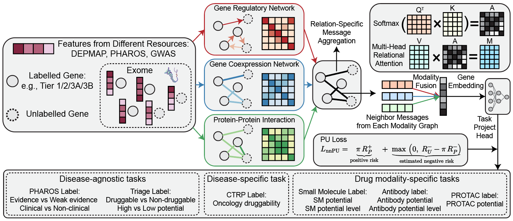

# KNOT: Knowledge Graph and Omics Integration Framework for Target Identification



A Graph Neural Network (GNN) framework that combines positive-unlabeled learning with heterogeneous graph networks for gene druggability prediction.

## Installation

```bash
# PyTorch (CUDA 12.1)
pip install torch==2.4.1+cu121 torchvision==0.19.1+cu121 torchaudio==2.4.1+cu121 --index-url https://download.pytorch.org/whl/cu121

# PyTorch Geometric
pip install torch-geometric==2.6.1
pip install pyg-lib torch-scatter torch-sparse torch-cluster torch-spline-conv -f https://data.pyg.org/whl/torch-2.4.0+cu121.html

# Other dependencies
pip install pandas==2.0.3 numpy==1.24.1 scikit-learn==1.3.2 scipy==1.10.1 tqdm networkx==3.0
```

## Data Structure

The framework now uses separate files for features and labels:

```
data/
├── gene_features.tsv                  # Gene features (503 features across 16 categories)
├── gene_labels.tsv                    # Task labels and annotations
├── gene_feature_summary.tsv           # Feature category breakdown
└── edge/                              # Network edge files
    ├── human.source                   # RegNetwork regulatory edges
    ├── trrust_rawdata.human.tsv       # TRRUST transcription factor edges
    ├── coexpression_edges_99p.tsv     # Co-expression edges
    └── ppi_symbol_links.tsv           # STRING PPI edges
```

## Quick Start

### Evaluation Mode (Train/Val/Test)

```bash
# Default task with all features
python main.py --task tier12_vs_others --mode evaluation

# Use only DepMap features
python main.py --task tier12_vs_others --mode evaluation --feature-config depmap_only

# Specific task with custom settings
python main.py --task tclin_vs_others --mode evaluation --epochs 100 --edge-config ppi_only
```

### Inference Mode (Rank All Genes)

```bash
# Generate gene rankings
python main.py --task tier12_vs_others --mode inference

# Custom configuration
python main.py --task cancer_druggability --mode inference --feature-config depmap_plus_pharos --epochs 200
```

## Tasks

Ten biologically motivated tasks across evidence levels, clinical relevance, and drug modalities.

| Category | Task | Task ID | Description |
|----------|------|---------|-------------|
| **Pharos (Disease-agnostic)** | Tclin vs Others | `tclin_vs_others` | FDA-approved targets vs others |
| | Strong Evidence | `tclin_tchem_vs_others` | Tclin+Tchem vs Tbio+Tdark |
| **Triage (Disease-agnostic)** | High Confidence | `tier1_vs_others` | Tier1 vs others |
| | Known Druggable | `tier12_vs_others` | Tier1+2 vs others |
| **Domain-specific** | Cancer Druggability | `cancer_druggability` | Cancer-specific targets |
| **Antibody Modality** | AB Top Targets | `ab_bucket1_vs_others` | Antibody bucket1 vs others |
| | AB Druggable | `ab_bucket123_vs_others` | Antibody buckets1-3 vs others |
| **Small Molecule** | SM Top Targets | `sm_bucket1_vs_others` | Small molecule bucket1 vs others |
| | SM Druggable | `sm_bucket123_vs_others` | Small molecule buckets1-3 vs others |
| **PROTAC** | PROTAC Targets | `protac_bucket1234_vs_others` | PROTAC buckets1-4 vs others |

## Feature Configurations

### Available Options
- `all_features`: All 503 features (21 DepMap + 482 non-DepMap)
- `depmap_only`: Only 21 DepMap features (CRISPR, CNV, expression, mutation)
- `non_depmap_only`: Only 482 non-DepMap features
- `depmap_plus_pharos`: DepMap + Pharos druggability features
- `depmap_plus_gnomad`: DepMap + GnomAD gene intolerance features

### Feature Categories (503 total)

| Category | Features | Description |
|----------|----------|-------------|
| **DepMap** | 21 | CRISPR dependency, CNV, expression, mutation |
| **ExAC** | 19 | CNV counts, intolerance scores, gene size |
| **GnomAD** | 15 | Gene intolerance metrics |
| **InterPro** | 97 | Protein family classification |
| **Pharos** | 8 | Druggability and genome features |
| **GWAS** | 6 | Disease/trait associations |
| **Genic Intolerance** | 6 | RVIS and MTR scores |
| **Mouse Genes** | 4 | Essential gene orthologs |
| **InWeb** | 4 | PPI network features |
| **Reactome** | 2 | Pathway annotations |
| **STRING_db** | 10 | Protein interaction data |
| **CTDbase** | 307 | Chemical-gene interactions |
| **DGIdb** | 1 | Drug-gene interaction types |
| **MGI** | 1 | Mouse phenotype data |
| **OMIM** | 1 | Disease associations |
| **GTEx** | 1 | Tissue expression specificity |

## Edge Configurations

- `all`: All networks (regulatory + co-expression + PPI)
- `regulatory`: Gene regulatory networks (RegNetwork + TRRUST)
- `functional`: Co-expression + PPI  
- `ppi_only`: Protein-protein interactions only
- `coexp_only`: Co-expression only
- `reg_ppi`: Regulatory + PPI
- `reg_coexp`: Regulatory + co-expression

## Key Parameters

- `--task`: Druggability task (default: tier12_vs_others)
- `--mode`: evaluation or inference (default: evaluation)
- `--feature-config`: Feature configuration (default: all_features)
- `--edge-config`: Edge type configuration (default: all)
- `--epochs`: Training epochs (default: 200)
- `--seed`: Random seed (default: 42)
- `--save-dir`: Output directory (default: ./results)

## Output Files

**Evaluation Mode:**
- `eval_results_[task]_[features]_[timestamp].json`: Performance metrics
- `model_[task]_[features]_[timestamp].pt`: Model checkpoint

**Inference Mode:**
- `gene_ranking_[task]_[features]_[timestamp].csv`: Ranked gene list
- `inference_model_[task]_[features]_[timestamp].pt`: Model checkpoint

## Examples

```bash
# Compare DepMap-only vs all features for known druggable prediction
python main.py --task tier12_vs_others --feature-config depmap_only --mode evaluation
python main.py --task tier12_vs_others --feature-config all_features --mode evaluation

# Test different network configurations  
python main.py --task tclin_vs_others --edge-config regulatory --mode evaluation
python main.py --task tclin_vs_others --edge-config functional --mode evaluation

# Generate rankings for cancer targets
python main.py --task cancer_druggability --mode inference --feature-config depmap_plus_pharos

```

## File Structure

```
KNOT_v0/
├── main.py              # Main training script
├── config.py            # Configuration settings
├── data_loader.py       # Data loading and preprocessing  
├── models.py            # GNN model architectures
├── trainer.py           # Training pipeline
├── utils.py             # Utility functions
├── results/             # Output directory
├── checkpoints/         # Model checkpoints
└── data/                # Dataset files
    ├── gene_features.tsv
    ├── gene_labels.tsv
    └── edge/
```
